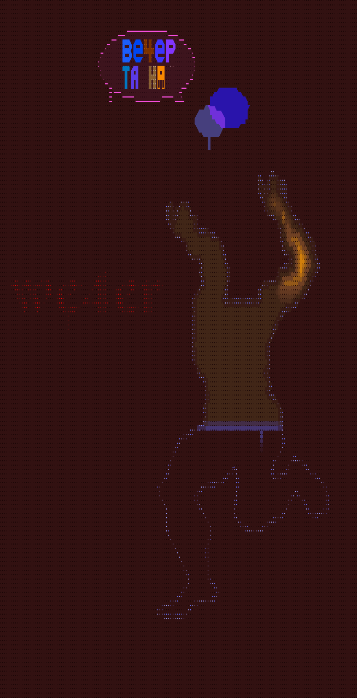

### Koriko
**This** is the last one from *90*, prob***4***. 
It's about a town and its streets, vhich are going
*up* and *down* or stay at the same level betveen *2*
crosses and are either *North-South* or *East-West* typeof streets,
[clck](https://ioinformatics.org/files/ioi1990round2.pdf).
**Koriko** is the town from the ***Ghibli's*** *Kiki's Delivery Service*
anime, becz the heights of the crosses are given vith respect to the ***Sea Level***.

The problem seems to be fairly easy, although I've experienced some
difficulties both with it's logic and with the language **(C++)**, 
but that's ***OK***. Basically there is nothing more to be said, 
it's a simple ***DFSearch*** Problem.

https://youtu.be/FJn0MWJPRMY
